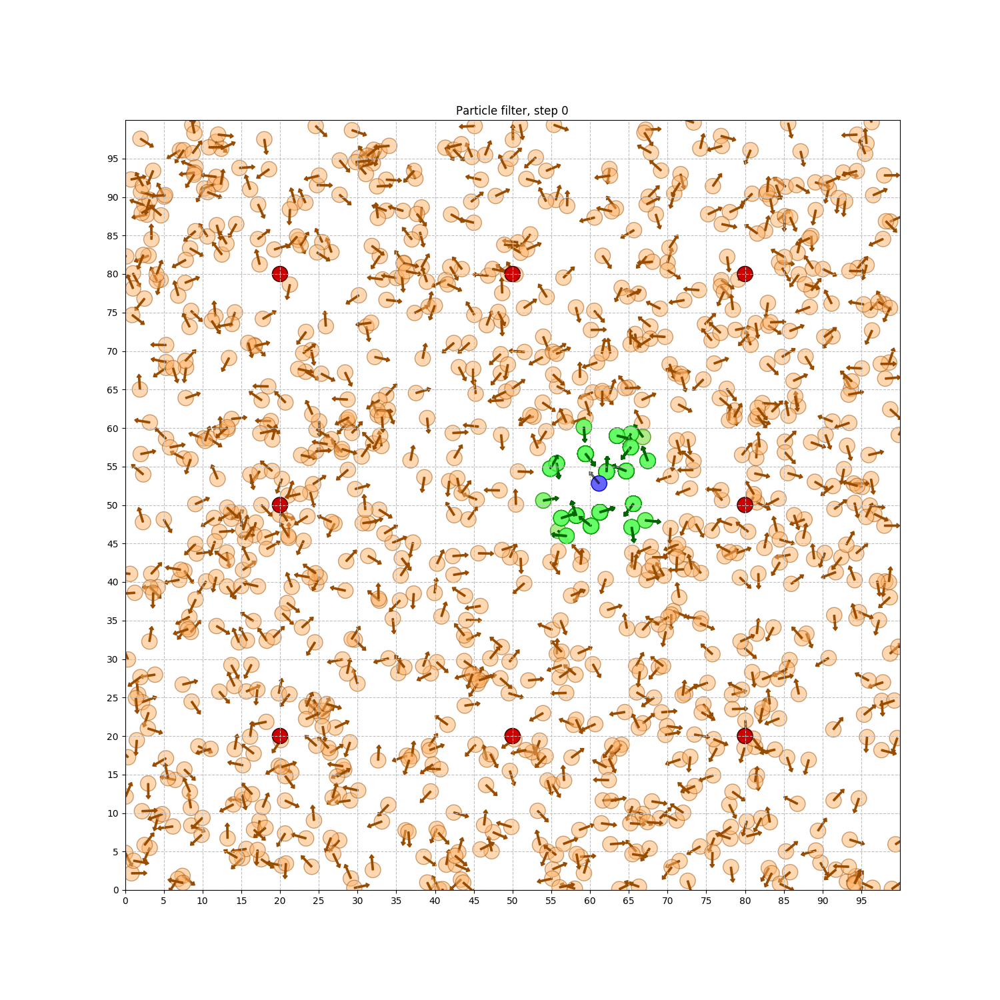
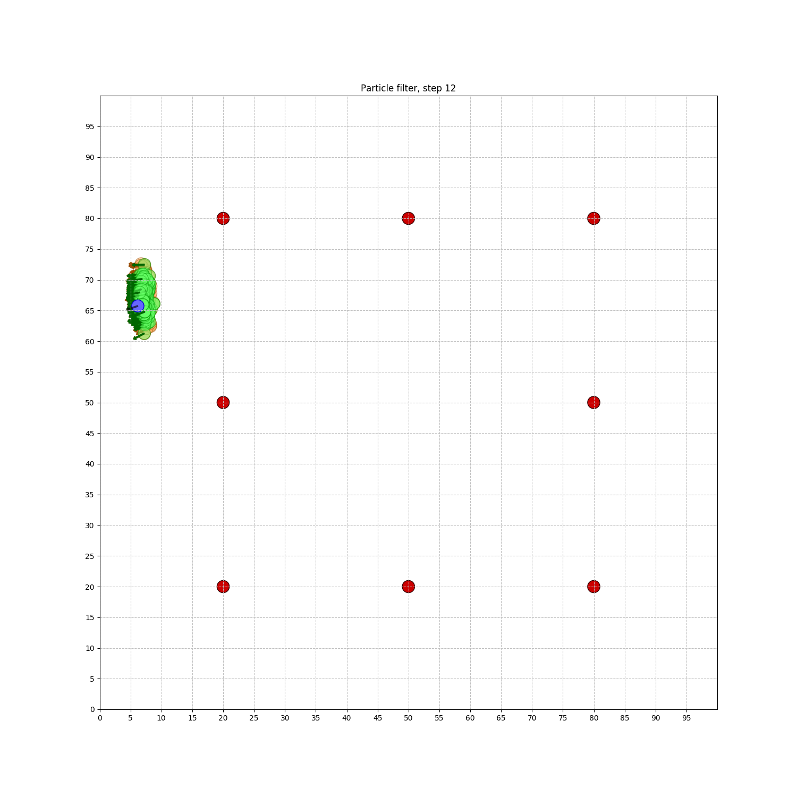

[](https://www.udacity.com/robotics)

# RoboND-MCLLab
Students will be able to observe `MCL` in action through the generated images. 

## Compiling and Running the Program:
```sh
$ mkdir -p ~/catkin_ws/src
$ cd ~/catkin_ws/src
$ catkin_init_workspace
ewfewfwfw$ catkin_make
```
## Example of Generated Images
#### Step1:

#### Step12:


