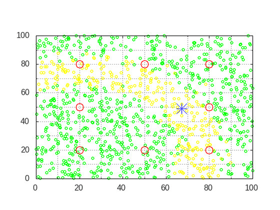

[](https://www.udacity.com/robotics)

# RoboND-MCL-Lab
In this project `MCL` algorithm can be observed step by step through generated images. 

### Editing the Program
Enter the code in the designated section:
```C++
//####   DON'T MODIFY ANYTHING ABOVE HERE! ENTER CODE BELOW ####
		
//TODO: Graph the position of the robot and the particles at each step 
```
Also there are some test cases that cam be run to ensure that each section 
in the project can be evaluted alone.
## Dependencies for Running Locally
* cmake >= 2.8
  * All OSes: [click here for installation instructions](https://cmake.org/install/)
* make >= 4.1 (Linux, Mac), 3.81 (Windows)
  * Linux: make is installed by default on most Linux distros
  * Mac: [install Xcode command line tools to get make](https://developer.apple.com/xcode/features/)
  * Windows: [Click here for installation instructions](http://gnuwin32.sourceforge.net/packages/make.htm)
* gcc/g++ >= 5.4
  * Linux: gcc / g++ is installed by default on most Linux distros
  * Mac: same deal as make - [install Xcode command line tools](https://developer.apple.com/xcode/features/)
  * Windows: recommend using [MinGW](http://www.mingw.org/)
* Matplot++  >= (check requirements in the repo)
  * For all platform and OS [Click here for installation instructions](https://github.com/alandefreitas/matplotplusplus)

## Basic Build Instructions

1. Clone this repo.
2. Make a build directory: `mkdir Debug && cd Debug`
3. Then source the workspace: `source devel/setup.bash`
4. Compile: `cmake .. && make` --> (Linuex OS) or `cmake .. -G "MinGW Makefiles" & mingw32-make` (windows)
5. Optional this flage in cmake  `USE_UNIT_TESTING` can be enable to allow testing
using gtest.

### Generated Images
After running the program, `50` images will be generated in the `Images` folder.




